<p align="center">

</p>

<p align="center">A library for isolated developing UI components and automatically taking snapshots of them.</p>

<p align="center">
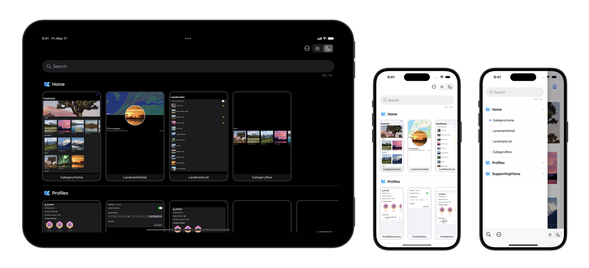
</p>

# Playbook

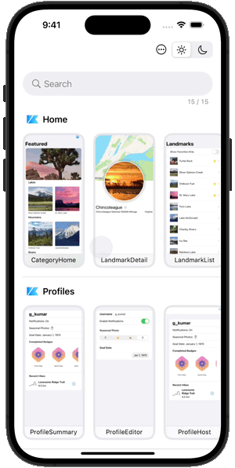

<a href="https://developer.apple.com/swift"></a>
<a href="https://github.com/playbook-ui/playbook-ios/actions"></a>
<a href="LICENSE"></a>
<br>
<a href="https://github.com/playbook-ui/playbook-ios/releases/latest"></a>
<a href="https://swift.org/package-manager"></a>

`Playbook` is a library that provides a sandbox for building UI components without having to worry about application-specific dependencies, strongly inspired by [Storybook](https://storybook.js.org/) for JavaScript in web-frontend development.  

Components built by using `Playbook` can generate a standalone app as living styleguide.  
This allows you to not only review UI quickly but also deliver more robust designs by separating business logics out of components.

Besides, snapshots of each component can be automatically generated by unit tests, and visual regression testing can be performed using arbitrary third-party tools.

For complex modern app development, it’s important to catch UI changes more sensitively and keep improving them faster.  
With the `Playbook`, you don't have to struggle through preparing the data and spend human resources for manual testings.  

<br clear="all">

---

## Usage

- [API Document](https://playbook-ui.github.io/playbook-ios/documentation/playbooksnapshot)
- [Example App](https://github.com/playbook-ui/playbook-ios/tree/master/Example)

---

### Playbook

`Playbook` is a framework that provides the basic functionality for managing components. It supports both `SwiftUI` and `UIKit`.  
Components are uniquely stored as scenarios. A `Scenario` has the way to layout component. Please check the API Doc for the variety of layouts.  

```swift
Playbook.default.addScenarios(of: "Home") {
    Scenario("CategoryHome", layout: .fill) {
        CategoryHome().environmentObject(UserData.stub)
    }

    Scenario("LandmarkList", layout: .fill) {
        NavigationView {
            LandmarkList().environmentObject(UserData.stub)
        }
    }

    Scenario("UIView red", layout: .fixed(length: 100)) {
        let view = UIView()
        view.backgroundColor = .red
        return view
    }
}
```

`ScenarioProvider` allows you to isolate additional scenarios and keep your playbook building clean.  

```swift
struct HomeScenarios: ScenarioProvider {
    static func addScenarios(into playbook: Playbook) {
        playbook.addScenarios(of: "Home") {
            Scenario("CategoryHome", layout: .fill) {
                CategoryHome().environmentObject(UserData.stub)
            }
        }
    }
}

struct AllScenarios: ScenarioProvider {
    static func addScenarios(into playbook: Playbook) {
        playbook.add(HomeScenarios.self)
    }
}
```

You can use the `ScenarioContext` passed to the closure that creates the component to get the screen size in snapshot, or wait before generating a snapshot.  

```swift
Scenario("MapView", layout: .fill) { context in
    MapView(coordinate: landmarkData[10].locationCoordinate) {
        // This closure will called after the map has completed to render.
        context.snapshotWaiter.fulfill()
     }
     .onAppear(perform: context.snapshotWaiter.wait)
}
```

---

### PlaybookUI

`PlaybookUI` is a framework that provides user interfaces made by `SwiftUI` for browsing a list of scenarios.  

#### PlaybookGallery

The component visuals are listed and displayed.  
Those that are displayed on the top screen are not actually doing layout, but rather display the snapshots that are efficiently generated at runtime.  

| Browser | Detail |
| ------- | ------ |
|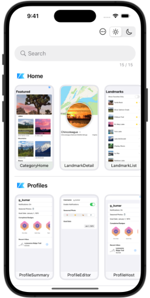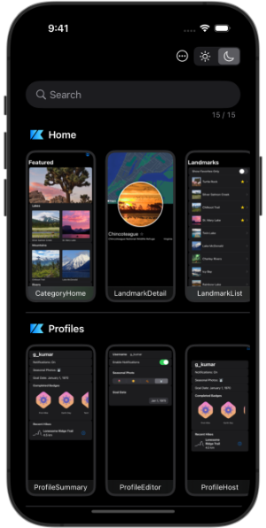|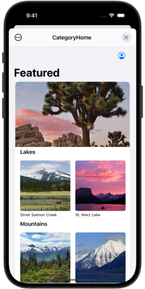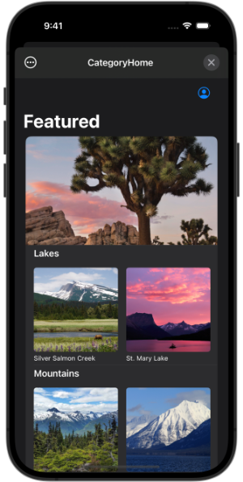|

#### PlaybookCatalog

The UI that search and select a scenario in a drawer. It's more similar to `Storybook`.  
If you have too many scenarios, this may be more efficient than `PlaybookCatalog`.  

| Browser | Detail |
| ------- | ------ |
|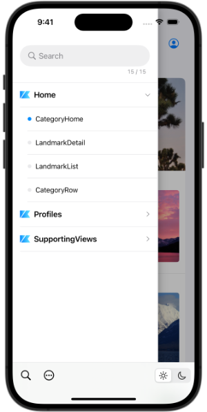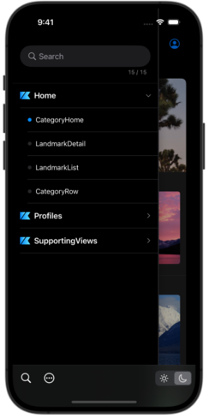|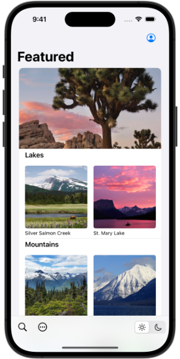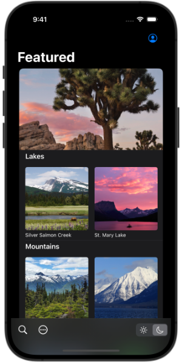|

#### How to Save Snapshot Images

To save snapshot images to the photo library from the share button on each UI, `NSPhotoLibraryAddUsageDescription` must be supported.  See the [official document](https://developer.apple.com/library/archive/documentation/General/Reference/InfoPlistKeyReference/Articles/CocoaKeys.html#//apple_ref/doc/uid/TP40009251-SW73) for more information.

---

### PlaybookSnapshot

Scenarios can be tested by the instance of types conform to `TestTool` protocol.  
`Snapshot` is one of them, which can generate the snapshots of all scenarios with simulate the screen size and safe area of the given devices.  
Since Playbook doesn't depend on XCTest, it doesn't necessarily need to be run on Unit-test.  

```swift
final class SnapshotTests: XCTestCase {
    func testTakeSnapshot() throws {
        let directory = ProcessInfo.processInfo.environment["SNAPSHOT_DIR"]!

        try Playbook.default.run(
            Snapshot(
                directory: URL(fileURLWithPath: directory),
                clean: true,
                format: .png,
                devices: [.iPhone15Pro(.portrait)]
            )
        )
    }
}
```

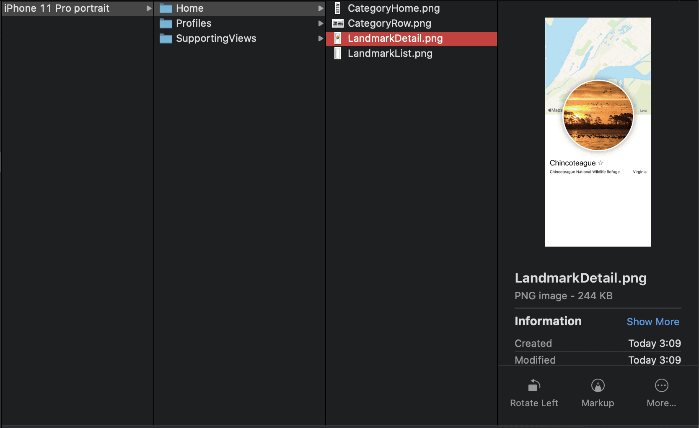

---

### [PlaybookAccessibilitySnapshot](https://github.com/playbook-ui/accessibility-snapshot-ios)

An extension to `Playbook` that uses [AccessibilitySnapshot](https://github.com/cashapp/AccessibilitySnapshot) to produce snapshots with accessibility information such as activation points and labels.

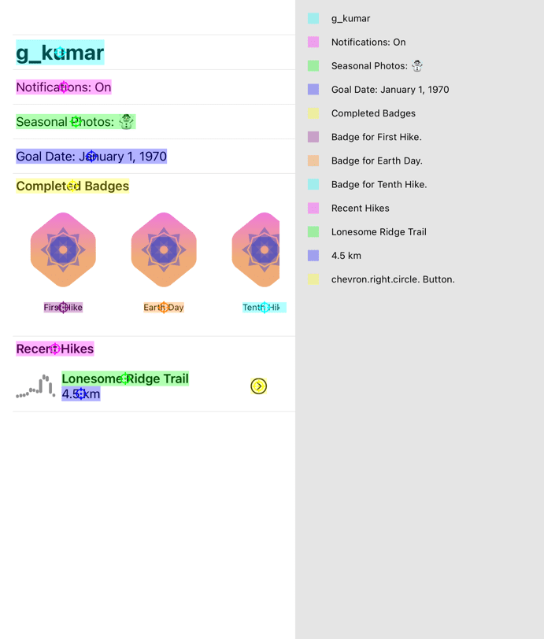

---

### Integration with Third-party Tools

The generated snapshot images can be used for more advanced visual regression testing by using a variety of third party tools.  

#### [percy](https://percy.io)

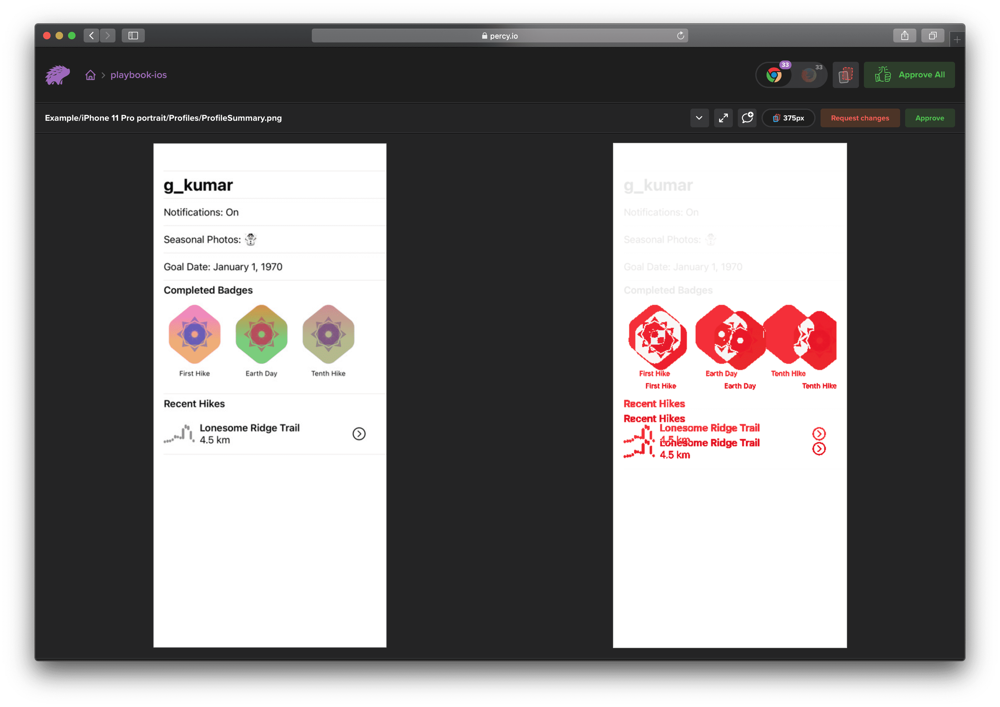

#### [reg-viz/reg-suit](https://github.com/reg-viz/reg-suit)

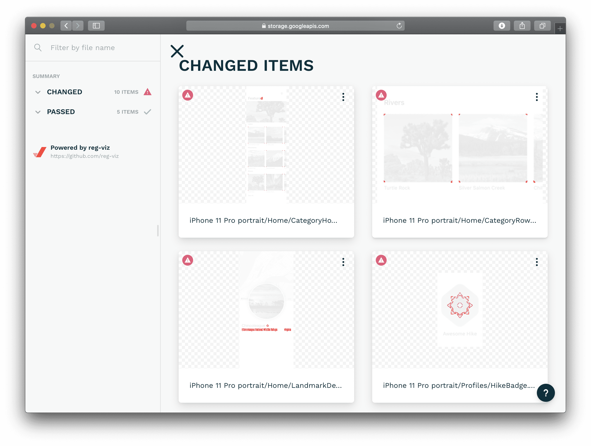

---

## Requirements

- Swift 5.10
- Xcode 15.4
- iOS 13.0+ (PlaybookUI: iOS 15.0+)

---

## Installation

Playbook features are separated into the following frameworks.  

- `Playbook`: Core system of component management.
- `PlaybookSnapshot`: Generates snapshots of all components.
- `PlaybookUI`: Products a browsing UI for components managed by Playbook.

### [Swift Package Manager](https://developer.apple.com/documentation/xcode/adding_package_dependencies_to_your_app)

Select Xcode menu `File > Swift Packages > Add Package Dependency...` and enter repository URL with GUI.

```
Repository: https://github.com/playbook-ui/playbook-ios
```

Note: Currently, SwiftPM doesn't support specifying the OS version for each library, so only `iOS13` is supported.  

---

## License

Playbook is released under the [Apache 2.0 License](https://github.com/playbook-ui/playbook-ios/tree/master/LICENSE).

<br>
<p align="center">

</p>
