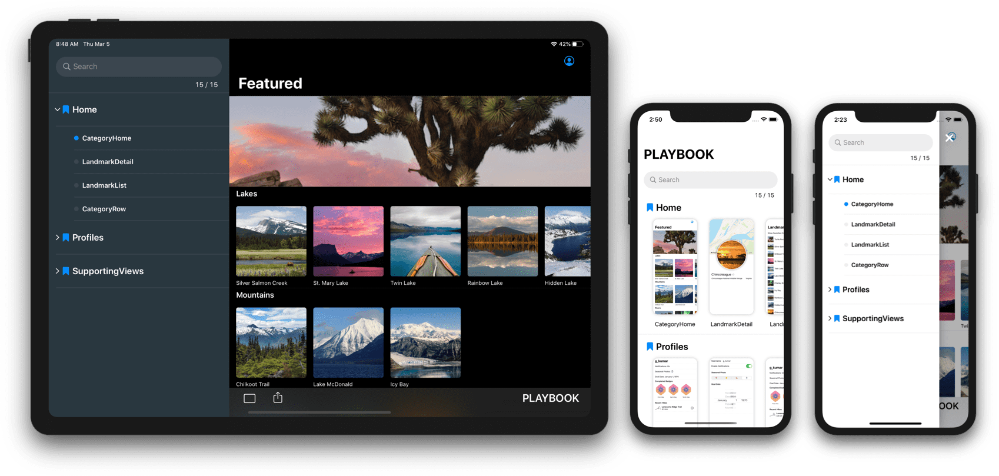
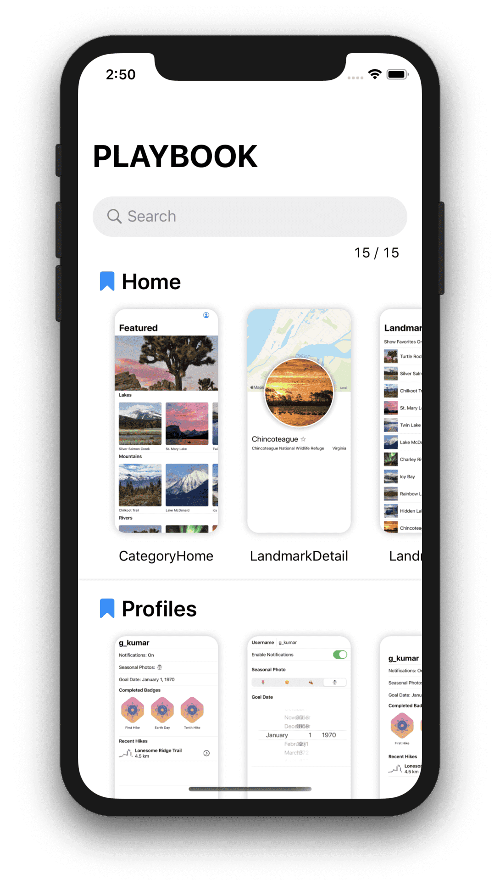
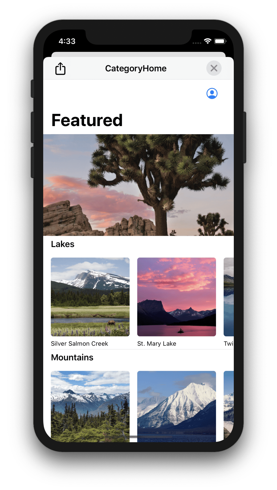
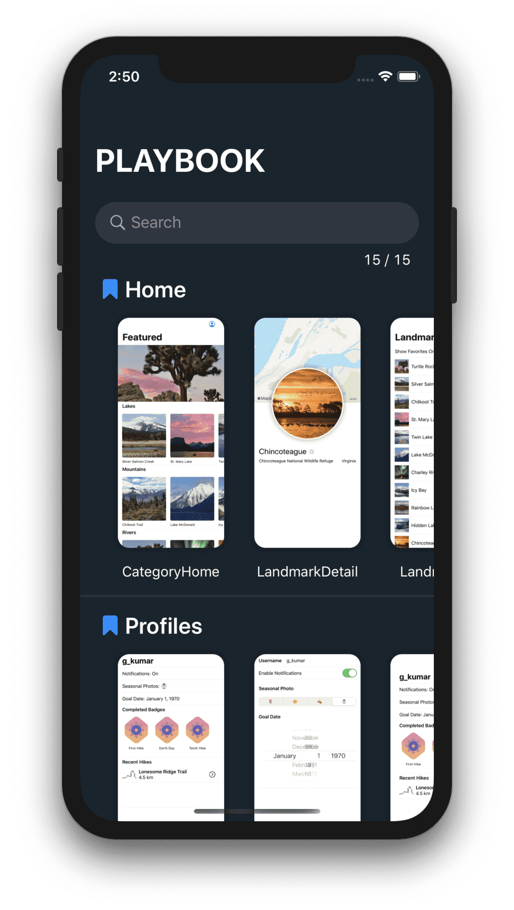
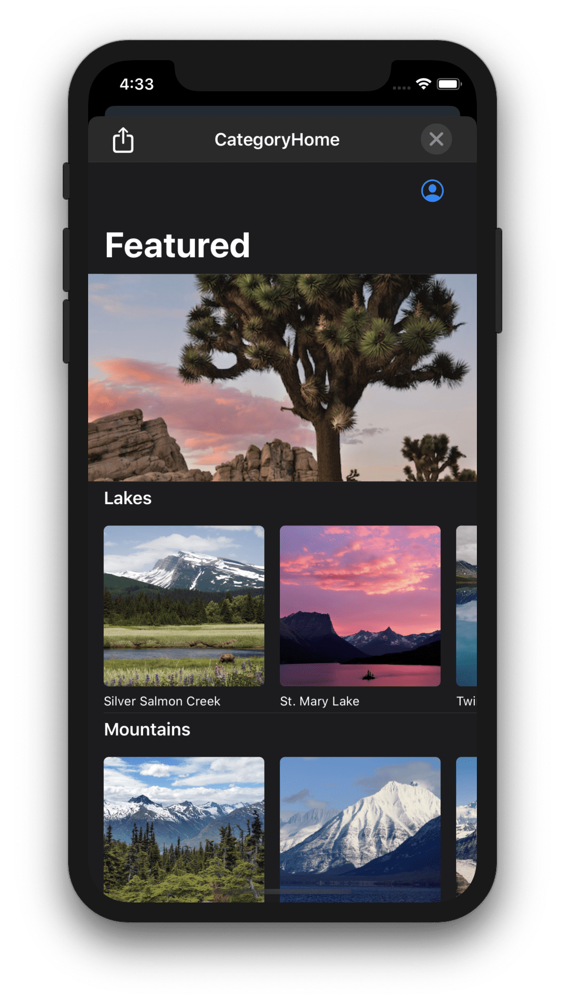
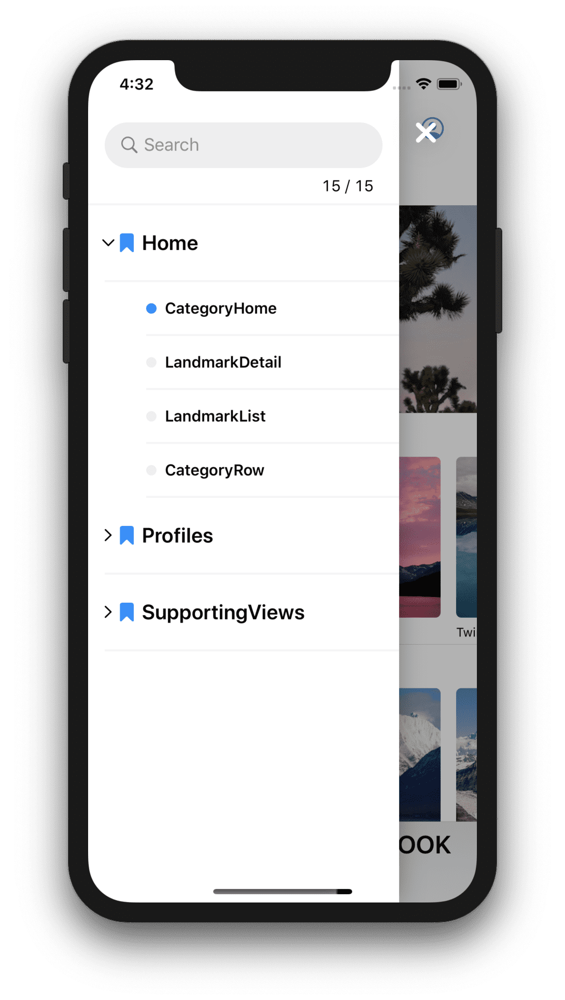
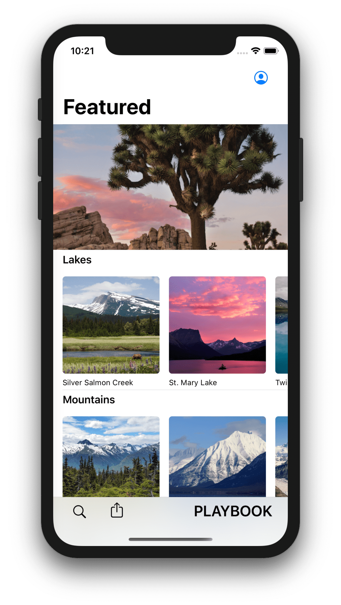
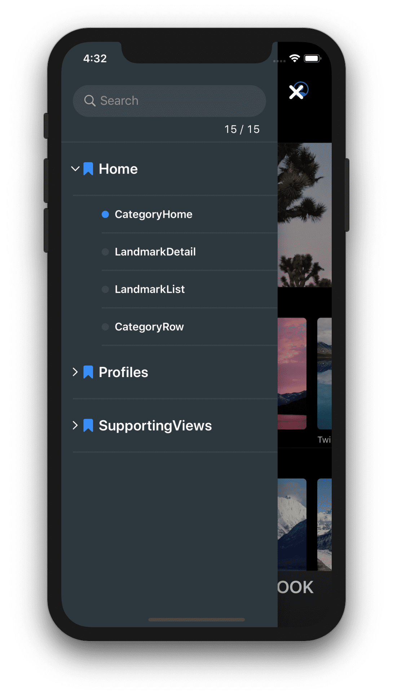
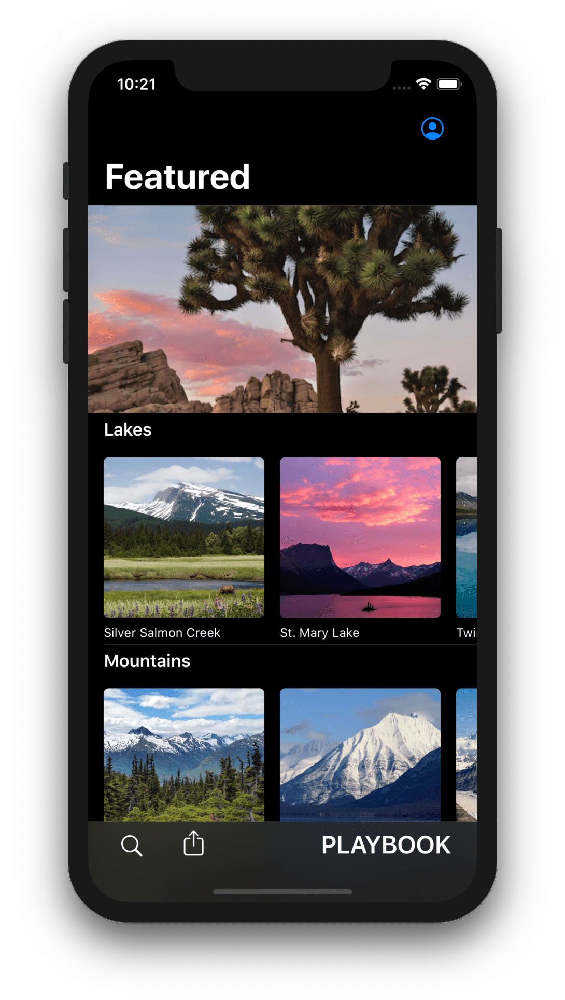
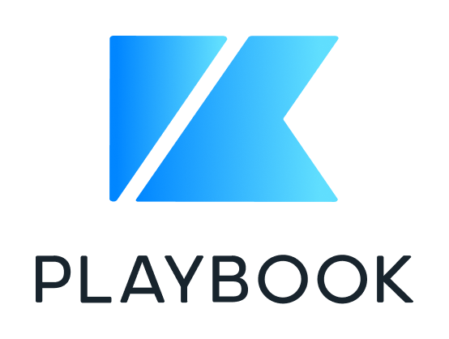

<p align="center">

</p>

<p align="center">A library for isolated developing UI components and automatically snapshots of them.</p>

<p align="center">

</p>

# Playbook


<a href="https://developer.apple.com/swift"></a>
<a href="https://github.com/playbook-ui/playbook-ios/actions"></a>
<a href="LICENSE"></a>
<br>
<a href="https://github.com/playbook-ui/playbook-ios/releases/latest"></a>
<a href="https://swift.org/package-manager"></a>
<a href="https://cocoapods.org/pods/Playbook"></a>
<a href="https://github.com/Carthage/Carthage"></a>

soon...

> *Android version is 🔜*

<br clear="all">

---

## Usage

### Playbook

soon...

### PlaybookSnapshot

soon...


### PlaybookUI

#### PlaybookGallery

| UI    | Browser | Detail |
| ----- | ------- | ------ |
| Light ||||
| Dark  |||

soon...

#### PlaybookCatalog

| UI      | Browser | Detail |
| ------- | ------- | ------ |
| Light   |||
| Dark    |||

soon...

#### How to Save Snapshot Images

soon...

### Integration with [reg-viz/reg-suit](https://github.com/reg-viz/reg-suit)

It's highly recommended to use `reg-suit` in order to sublimate the snapshot images generated by Playbook to the visual regression test.

soon...

---

## Requirements

- Swift 5.1+
- Xcode 11.0+
- iOS
  - Playbook: 11.0+
  - PlaybookSnapshot: iOS11.0
  - PlaybookUI: iOS11.0

---

## Installation

Playbook features are separated into the following frameworks.  

- Playbook: Core system of component management.
- PlaybookSnapshot: Generates snapshots of all components.
- PlaybookUI: Products a browsing UI for components managed by Playbook.

### [CocoaPods](https://cocoapods.org)

Add the following to your `Podfile`:

```ruby
pod 'Playbook' # Playbook, PlaybookSnapshot and PlaybookUI
```

```ruby
pod 'Playbook/System' # Playbook only
```

```ruby
pod 'Playbook/Snapshot' # Playbook and PlaybookSnapshot
```

```ruby
pod 'Playbook/UI' # Playbook and PlaybookUI
```

### [Carthage](https://github.com/Carthage/Carthage)

Add the following to your `Cartfile`:

```
github "playbook-ui/playbook-ios"
```

### [Swift Package Manager](https://developer.apple.com/documentation/xcode/adding_package_dependencies_to_your_app)

Select Xcode menu `File > Swift Packages > Add Package Dependency...` and enter repository URL with GUI.

```
Repository: https://github.com/playbook-ui/playbook-ios
```

---

## Development

soon...

### TODO

- [ ] Write README completely.
- [ ] Compare snapshot diffs without dependency.
- [ ] Visual regression testing on CI.
- [ ] Automatic deployment for CocoaPods on CI.

---

## License

Playbook is released under the [Apache 2.0 License](LICENSE).

<br>
<p align="center">

</p>
